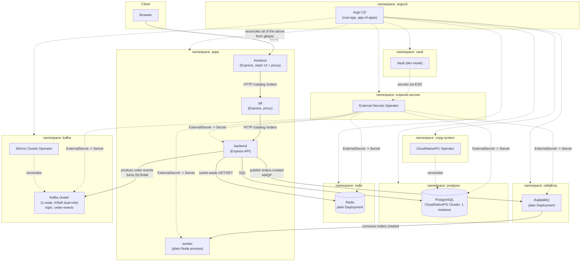

# cloud-native-lab

A cloud-native lab that reproduces the day-to-day reality of a platform/SRE
engineer: infrastructure as code, GitOps delivery, secret management,
Kubernetes-operated data services, and asynchronous messaging — under real
cost constraints. It is also an experiment in AI agent orchestration:
specialized agents build the project, coordinated by an orchestrator
session, with a human observing and approving at defined gates.

Full context lives in [`docs/`](docs/); this file is an entry point, not a
replacement for it. See [`docs/vision.md`](docs/vision.md) for the complete
rationale and non-goals.

## The scenario

A simplified e-commerce order platform. Every component exists because the
scenario needs it:

| Component  | Role                                                       |
|------------|--------------------------------------------------------------|
| Frontend   | Storefront UI (static page + a thin proxy to the BFF)        |
| BFF        | Backend-for-frontend: proxies/aggregates backend calls        |
| Backend    | Orders/catalog API (business logic, source of truth writes)   |
| PostgreSQL | Transactional store for orders (via the CloudNativePG operator) |
| Redis      | Catalog cache (cache-aside)                                   |
| RabbitMQ   | Task queue: order created → worker sends email/invoice (stub) |
| Kafka      | Immutable event log: order lifecycle events for future consumers |
| Vault      | Secret management for every credentialed service above        |

`docs/vision.md`'s non-goals apply throughout: no high availability, no
production hardening beyond sensible defaults, minimal application code —
the platform is the product, not the storefront.

## Status: through Phase 6

This README describes the system **as it stands through Phase 6** (see
`TASKS.md` and `docs/phase-logs/`): Foundation, Delivery, Secrets, Data,
Applications, and Messaging are done and merged. Phase 7 (Airflow ETL +
kube-prometheus-stack observability) is in progress and intentionally not
reflected here yet — this file will be updated once that work merges.

## Architecture

Everything below `gitops/` is reconciled by Argo CD from a single
app-of-apps root (`gitops/root-app.yaml`). Infra components
(Vault, External Secrets Operator, the CloudNativePG operator, the Strimzi
operator) live under `gitops/apps/`; data workloads and application
services live under `gitops/data/` and `gitops/services/`.



Notes grounded in the actual manifests (not the original plan):

- BFF and frontend have **no** Vault wiring — they hold no credentials
  (pure HTTP proxies), so no `SecretStore`/`ExternalSecret` exists for them
  (`gitops/services/README.md`).
- Worker has its **own** Vault identity (`worker-vault-auth`), scoped only
  to RabbitMQ credentials — it does not reuse backend's.
- Redis and RabbitMQ are plain `Deployment`s with no operator and no PVC
  (ADR-007, ADR-011): losing unconsumed cache/queue data on a pod restart
  is an accepted trade-off in this ephemeral lab.
- Postgres uses the CloudNativePG operator, 1 instance, no HA (ADR-008).
  Kafka uses the Strimzi operator, 1-node KRaft cluster, no HA (ADR-012).
- Kafka's internal listener is plaintext with SASL/SCRAM-SHA-512
  authentication — no TLS, consistent with every other in-cluster service
  trusting the cluster network boundary.
- The backend's `KafkaUser` is producer-only (`Describe`+`Write` on
  `order-events`); nothing in this repo's shipped workloads consumes that
  topic yet. A debug-only, Strimzi-generated-credential `KafkaUser`
  (`gate-verifier`, ADR-015) exists solely for manual verification via
  `kubectl` and is not a running workload — it is intentionally omitted
  from the diagram above. Phase 7's Airflow consumer is the real,
  workload-backed reader and is not part of this diagram yet.

See [`docs/order-flow.md`](docs/order-flow.md) for how an order actually
moves through the sync path and both async paths.

## Repository layout

```
local/kind/     # Local Kind cluster config (not Terraform-managed)
terraform/      # Foundation (GCP/GKE) + delivery (Argo CD bootstrap)
gitops/         # Everything Argo CD reconciles
  root-app.yaml # App-of-apps root
  apps/         # Infra Application manifests (vault, ESO, cnpg operator, strimzi)
  data/         # Data workloads (postgres, redis, rabbitmq, kafka)
  services/     # Application workloads (backend, bff, frontend, worker)
apps/           # Application source code, one directory per service
docs/           # Vision, architecture, phases, conventions, ADRs, phase logs
scripts/        # Operational scripts (e.g. Vault dev-mode bootstrap)
```

## Running it locally (Kind)

This lab targets a local [Kind](https://kind.sigs.k8s.io/) cluster before
any cloud spend, per
[`docs/adr/004-local-first-validation-with-kind.md`](docs/adr/004-local-first-validation-with-kind.md).

1. **Create the cluster**

   ```sh
   kind create cluster --config local/kind/kind-config.yaml
   ```

   See [`local/kind/README.md`](local/kind/README.md).

2. **Bootstrap Argo CD + the app-of-apps root**

   ```sh
   cd terraform/delivery
   terraform init
   terraform apply -target=module.argocd \
     -var="kubeconfig_context=kind-cloud-native-lab" \
     -var="argocd_chart_version=10.2.2" \
     -var="gitops_repo_url=https://github.com/alisson92/cloud-native-lab.git"
   terraform apply \
     -var="kubeconfig_context=kind-cloud-native-lab" \
     -var="argocd_chart_version=10.2.2" \
     -var="gitops_repo_url=https://github.com/alisson92/cloud-native-lab.git"
   ```

   Two-phase apply is required — see
   [`terraform/delivery/README.md`](terraform/delivery/README.md) for why.
   Argo CD then reconciles everything under `gitops/` on its own.

3. **Bootstrap Vault** (dev mode loses its Kubernetes auth method and KV
   data on every restart, so this is re-run after any `vault-0` restart)

   ```sh
   ./scripts/bootstrap-vault.sh
   ```

   See the script's own header comment and
   [`docs/adr/010-vault-bootstrap-script.md`](docs/adr/010-vault-bootstrap-script.md).

4. **Wait for everything to sync**

   ```sh
   kubectl -n argocd get application
   # root-app and every child Application should be Synced/Healthy.
   ```

5. **Place an order end-to-end**

   ```sh
   kubectl -n apps port-forward svc/frontend 8082:8082
   # http://localhost:8082/ in a browser: browse the catalog, place an order.
   ```

   Confirm the worker picked up the RabbitMQ message:

   ```sh
   kubectl -n apps logs deploy/worker
   # "order <id>: sending email + invoice (stub) ..."
   ```

6. **Tear down**

   ```sh
   kind delete cluster --name cloud-native-lab
   ```

For the full sequence including GKE, see
[`terraform/README.md`](terraform/README.md).

## Documentation map

- [`docs/vision.md`](docs/vision.md) — why this project exists, the
  scenario, definition of success.
- [`docs/architecture.md`](docs/architecture.md) — build order, integration
  map, repository layout, architectural principles.
- [`docs/phases.md`](docs/phases.md) — phase ownership and exit gates.
- [`docs/conventions.md`](docs/conventions.md) — language, Git, Terraform,
  Kubernetes/GitOps, and documentation conventions.
- [`docs/adr/`](docs/adr/) — architectural decision records (the "why"
  behind every non-default choice).
- [`docs/phase-logs/`](docs/phase-logs/) — archived per-phase task logs.
- [`docs/order-flow.md`](docs/order-flow.md) — order flow diagram (sync +
  both async paths), grounded in `apps/backend/src/` and
  `apps/worker/src/`.

## License

No license file is present; treat this repository as "all rights reserved"
unless a `LICENSE` file is added.
