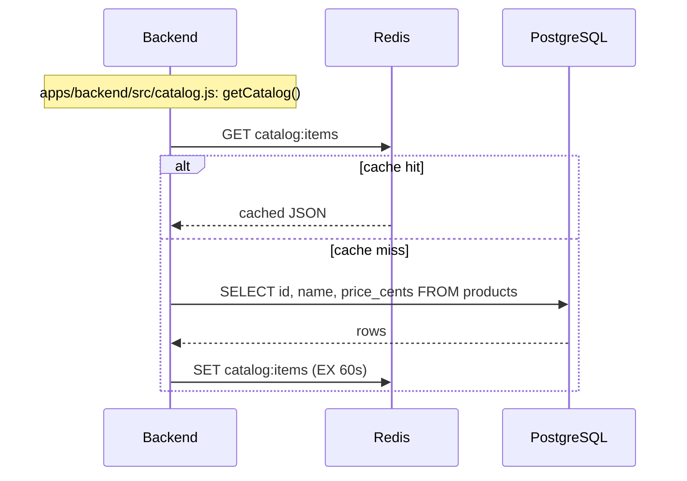

# Order flow

How placing an order actually moves through the system, grounded in the
real request/publish/consume code — not an idealized version of it. Every
step below is traceable to a specific file.

## Scope

- **Sync path**: browser → frontend → BFF → backend → PostgreSQL/Redis.
  This is what the HTTP response to "place an order" waits on.
- **Async path 1 (RabbitMQ, task queue)**: backend publishes an
  `orders.created` message; the worker consumes it and does a stubbed
  email/invoice.
- **Async path 2 (Kafka, event log)**: backend produces an `order.created`
  event to the `order-events` topic. Through Phase 6, no consumer shipped
  in this repo (the exit gate was verified with a debug-only
  `gate-verifier` identity, not a running workload — see
  `docs/adr/015-kafka-gate-verifier-user.md`). As of Phase 7, Airflow's
  `sales_report` DAG (`consume_order_events` task,
  `gitops/data/airflow/dags-configmap.yaml`) is the first real,
  workload-backed consumer — it replays the topic on a nightly schedule
  (02:00 UTC) and on manual triggers, independently of the request path.
  It is out of scope for this order-placement diagram below (it does not
  run synchronously with an order being placed); see the root
  [`README.md`](../README.md#architecture) for how it fits the overall
  architecture.

Both async publishes are **best-effort and non-blocking**: a publish
failure is logged and swallowed, never surfaced to the HTTP caller, and
never rolls back the order — the order is already durably committed to
Postgres before either publish is attempted
(`apps/backend/src/orders.js`).

## Diagram

```mermaid
sequenceDiagram
    participant Browser
    participant Frontend as frontend<br/>(apps/frontend/src/index.js)
    participant BFF as bff<br/>(apps/bff/src/index.js)
    participant Backend as backend<br/>(apps/backend/src/index.js)
    participant PG as PostgreSQL
    participant Redis
    participant RabbitMQ
    participant Worker as worker<br/>(apps/worker/src/rabbitmq.js)
    participant Kafka as Kafka<br/>(order-events topic)

    Browser->>Frontend: POST /api/orders {productId, quantity}
    Frontend->>BFF: POST /orders (bffClient.js)
    BFF->>Backend: POST /orders (backendClient.js)

    Note over Backend,PG: apps/backend/src/orders.js: createOrder()
    Backend->>PG: BEGIN
    Backend->>PG: SELECT price_cents FROM products WHERE id = $1
    Backend->>PG: INSERT INTO orders (...) RETURNING id
    Backend->>PG: COMMIT

    alt COMMIT succeeded
        Backend-->>Backend: order = {id, productId, quantity, totalCents}

        par RabbitMQ publish (best-effort, non-blocking)
            Backend->>RabbitMQ: sendToQueue("orders.created", order, persistent:true)
            Note right of Backend: publish failure is caught and logged;<br/>never fails the HTTP response
        and Kafka publish (best-effort, non-blocking)
            Backend->>Kafka: producer.send(topic:"order-events",<br/>key:order.id, value:{type:"order.created", order})
            Note right of Backend: publish failure is caught and logged;<br/>never fails the HTTP response
        end

        Backend-->>BFF: 201 {id, productId, quantity, totalCents}
        BFF-->>Frontend: 201 (same shape)
        Frontend-->>Browser: 201 confirmation
    else COMMIT failed / validation error
        Backend->>PG: ROLLBACK
        Backend-->>BFF: 4xx/5xx {error}
        BFF-->>Frontend: 4xx/5xx
        Frontend-->>Browser: 4xx/5xx
    end

    RabbitMQ->>Worker: consume("orders.created")
    Worker->>Worker: handleOrderCreated(order)<br/>(stub: log "sending email + invoice")
    Worker->>RabbitMQ: ack

    Note over Kafka: order-events is an immutable, replayable log.<br/>Airflow's sales_report DAG (Phase 7) replays it nightly<br/>and on manual triggers — independently of this request path.
```

## Catalog read path (cache-aside, not order-specific)

The catalog listing (`GET /catalog`) exercises Redis independently of the
order flow above — included here because it is the only place Redis is
used in this system:



## Grounding notes

- The two async publishes are issued from the **same function**
  (`createOrder` in `apps/backend/src/orders.js`), sequentially in code
  (RabbitMQ call, then Kafka call), each wrapped in its own `try/catch` —
  drawn here as parallel (`par`) because neither depends on the other and
  a failure in one does not block the other.
- RabbitMQ: queue `orders.created`, `durable: true`, message
  `persistent: true` (`apps/backend/src/rabbitmq.js`,
  `apps/worker/src/rabbitmq.js`). The worker acknowledges manually after
  its (stubbed) handler runs; a message that fails to parse is `nack`ed
  without requeue — no dead-letter exchange is configured in this lab.
- Kafka: topic `order-events`, message keyed by `order.id` (so all events
  for one order land on the same partition), `acks: 1`, SASL/SCRAM-SHA-512
  over a plaintext (no TLS) internal listener
  (`apps/backend/src/kafka.js`, `gitops/data/kafka/cluster.yaml`).
- The backend's Kafka producer connects at process startup
  (`apps/backend/src/index.js`); this is why the backend's Argo CD sync
  wave is pinned after the `KafkaUser` CR (see
  `docs/adr/012-kafka-strimzi-kraft-and-vault-user.md`, "Also harder
  (startup ordering)").
